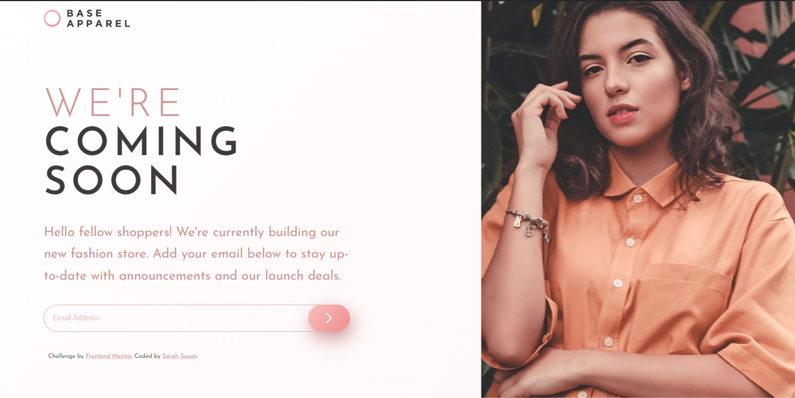
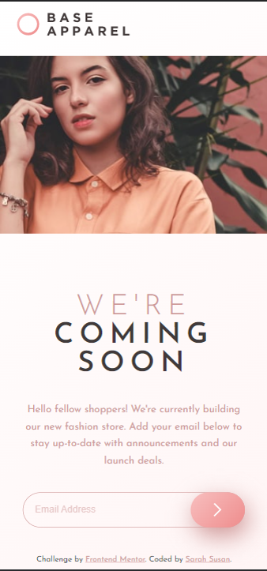

# Frontend Mentor - Base Apparel coming soon page solution

This is a solution to the [Base Apparel coming soon page challenge on Frontend Mentor](https://www.frontendmentor.io/challenges/base-apparel-coming-soon-page-5d46b47f8db8a7063f9331a0). Frontend Mentor challenges help you improve your coding skills by building realistic projects. 

## Table of contents

- [Overview](#overview)
  - [The challenge](#the-challenge)
  - [Screenshot](#screenshot)
  - [Links](#links)
- [My process](#my-process)
  - [Built with](#built-with)
  - [What I learned](#what-i-learned)
- [Author](#author)

## Overview

A simple page yet a complex enough layout which made this a wonderful practice project. I made use of HTML 5, CSS & Sass and simple Javascript to build this website.

### The challenge

Users should be able to:

- View the optimal layout for the site depending on their device's screen size
- See hover states for all interactive elements on the page
- Receive an error message when the `form` is submitted if:
  - The `input` field is empty
  - The email address is not formatted correctly

### Screenshot

Desktop View:

Mobile View:

### Links

- Solution URL: [Solution](https://github.com/velvetrose/Base-Apparel-coming-soon-page.git)
- Live Site URL: [Live Site](https://velvetrose.github.io/Base-Apparel-coming-soon-page/)

## My process

Started with the Mobile-first workflow after which i switched up the flexbox layout and direction within the media screens section in CSS.

### Built with

- Semantic HTML5 markup
- CSS custom properties
- Flexbox
- CSS Grid
- Mobile-first workflow
- JavaScript
- [Sass](https://sass-lang.com) - CSS extension language

### What I learned

This tested my flexbox knowledge so much, along with positioning and layout changes when the window is switched between dimensions.

## Author

- Frontend Mentor - [@yvelvetrose](https://www.frontendmentor.io/profile/velvetrose)

